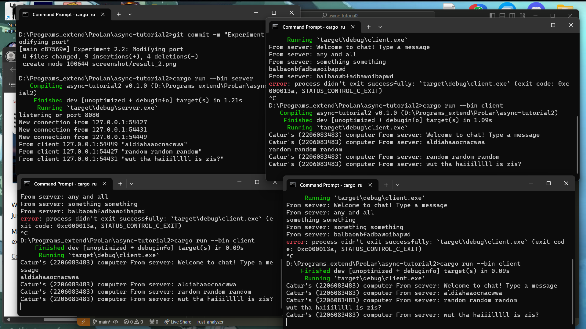

# async-tutorial2
1. Original code

Untuk dapat menjalankan server dan client secara terpisah, kita harus membuat mereka menjadi binary yang berbeda di cargo.toml lalu kita buka project melalui beberapa cli sekaligus dan memulai satu sebagai server dan 3 sebagai client (dengan cargo run --bin nama-bin). Ketika kita mengetik beberapa hal di client dan mengetik enter, pesan dari client akan terkirim ke server dan server mengirimkan pesan tersebut ke semua client. Lalu ketika client mendapat update dari server, client akan mencetak "from server: " lalu pesan yang diterima dari server.

2. Modify 

Hal yang harus diganti agar program bisa berjalan seperti seharusnya adalah memodifikasi port yang dibind oleh TCPListener menjadi 8080 di fungsi main server.rs. Dapat dilihat bahwa socket yang digunakan oleh server bukanlah webserver melainkan TCP Socket dan listener yang digunakan akan menunggu koneksi apapun yang dilakukan ke uri yang dibind yaitu localhost:8080 dan mengaccept koneksi secara otomatis. Pendefinisian dari penggunaan TCP pada server dilakukan dengan menggunakan modul TCPListener yang disediakan oleh rust dari tokio.