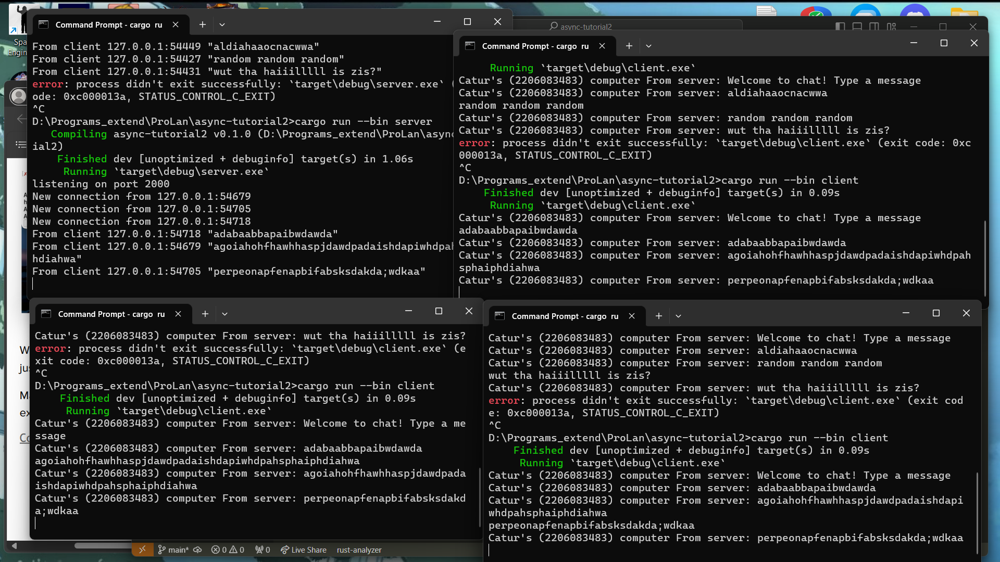

# async-tutorial2

Untuk dapat menjalankan server dan client secara terpisah, kita harus membuat mereka menjadi binary yang berbeda di cargo.toml lalu kita buka project melalui beberapa cli sekaligus dan memulai satu sebagai server dan 3 sebagai client (dengan cargo run --bin nama-bin). Ketika kita mengetik beberapa hal di client dan mengetik enter, pesan dari client akan terkirim ke server dan server mengirimkan pesan tersebut ke semua client. Lalu ketika client mendapat update dari server, client akan mencetak "from server: " lalu pesan yang diterima dari server.